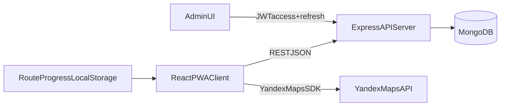

# План реализации туристического PWA (Рязань)

## Контекст

Репозиторий сейчас пустой (только `README`), поэтому стартуем с нуля как монорепо: `client` (React PWA, mobile-first) + `server` (Node.js/Express + MongoDB).

## Архитектура MVP

## Этап 1 — Монорепо и базовая инфраструктура

- Создать каркас директорий: `[client](client)` и `[server](server)`.
- Инициализировать npm-проекты и root-скрипты для одновременного запуска (dev/build/start/lint).
- Добавить `.env.example` в корень и отдельно в `[client/.env.example](client/.env.example)` и `[server/.env.example](server/.env.example)`; исключить реальные `.env` через `.gitignore`.
- Базовые зависимости:
  - client: React, роутер, `@pbe/react-yandex-maps`, PWA plugin/tooling.
  - server: Express, Mongoose, JWT, bcrypt, cors, dotenv.

## Этап 2 — Backend API (приоритет маршрутов)

- Реализовать модели Mongo:
  - `Route` (название, описание, дистанция, длительность, точки, fallback-транспорт).
  - `RoutePoint` (порядок, координаты, заголовок, описание, QR-идентификатор).
  - `AdminUser` (email, passwordHash, роль).
  - `TransportInfo` (связь с сегментом маршрута, номер маршрута, остановки, источник: yandex/manual).
- Реализовать публичные эндпоинты:
  - `GET /api/routes` (список), `GET /api/routes/:id` (детали + точки).
  - `POST /api/routes/:id/build` с режимом `walking|masstransit` (получение маршрута + транспортных сегментов).
- Реализовать админ-эндпоинты (JWT-protected): CRUD маршрутов/точек/transport fallback.
- Реализовать auth только для админа:
  - `POST /api/admin/auth/login`, `POST /api/admin/auth/refresh`, `POST /api/admin/auth/logout`.
- Реализовать seed-скрипт:
  - создать admin `admin@admin.com` / `admin123`.
  - добавить 1–2 демо-маршрута по Рязани по 3–5 точек.

## Этап 3 — Frontend (mobile-first PWA)

- Структура экранов:
  - список маршрутов;
  - карточка/детали маршрута;
  - экран карты с переключателем режима `Пешком/С транспортом`;
  - пошаговый прогресс маршрута с QR-заглушкой;
  - заглушки `Войти` и `Регистрация`.
- Интегрировать `@pbe/react-yandex-maps`:
  - отображение точки/поли-линии маршрута;
  - построение в 2 режимах через backend API;
  - вывод транспортных данных (маршруты, остановки) для `masstransit`.
- Реализовать localStorage-прогресс маршрута (completed points, start/end time, текущий этап).
- Включить PWA (manifest + service worker baseline), без требования офлайна.

## Этап 4 — Админ-панель

- Разделы:
  - вход админа;
  - список маршрутов + CRUD;
  - редактор точек (добавить/удалить/переупорядочить);
  - блок ручного fallback транспорта.
- Доступ к админке только с валидным JWT; refresh-механика на клиенте.

## Этап 5 — QR-геймификация (минимальная заглушка)

- Кнопка `Сканировать QR-код` запускает имитацию проверки текущей точки.
- При успехе: точка помечается `пройдена`, показывается поздравление и доступен следующий этап.
- После всех точек: финальный экран со статистикой (время, количество пройденных точек).

## Этап 6 — UI система (Colorful)

- Ввести токены (цвета/типографика/spacing) в `[client/src/styles](client/src/styles)`.
- Применить контрастную палитру и градиентные акценты к карточкам маршрутов, CTA и прогрессу.
- Соблюсти мобильные UX-правила: touch targets 44px+, контраст, заметный focus.

## Этап 7 — Тесты и приемка

- Backend: smoke tests ключевых API (routes/build/admin auth).
- Frontend: сценарная проверка mobile-flow:
  - открыть маршрут → выбрать режим → увидеть маршрут/транспорт → пройти QR-заглушки → финальный экран.
- Проверить env-конфигурацию и отсутствие секретов в git.

## Критерии готовности MVP

- Карта и построение маршрута работают в `walking` и `masstransit`.
- Для транспортного режима видны номера маршрутов и остановки (из API или admin fallback).
- Админ может авторизоваться и управлять маршрутами/точками/транспортом.
- Пользовательский прогресс сохраняется в localStorage.
- Кнопки `Войти`/`Регистрация` ведут на страницу `Функция в разработке`.
- В БД есть seeded админ и демо-маршруты Рязани.

